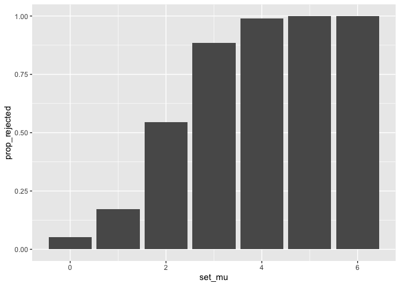
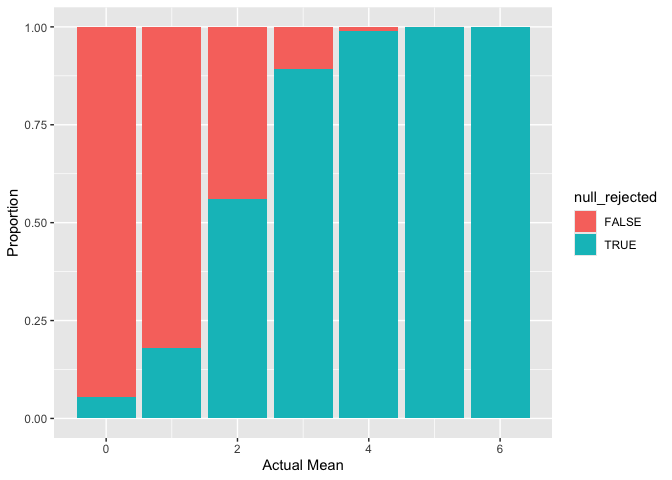
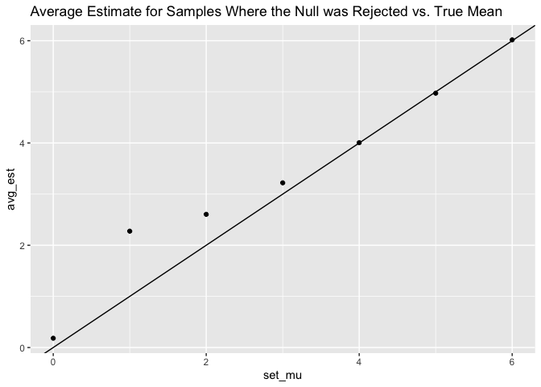

p8105_hw5_kac2301
================
Kate Colvin

# Problem 1

sdjfsjkd

# Problem 2

``` r
# Creating output vector to store t.test results 
output <- vector("list", 35000)

n = 30
mu = 0:6
sigma = 5 

for(j in mu){
  k <- 1+(j*5000)
  # Looping over 5000 data sets 
  for (i in 1:5000) {
      sim_data = tibble(
        x = rnorm(n, mean = j, sd = sigma),
      )
      output[[k]] <- t.test(sim_data, mu = 0, conf.level = 0.95) %>% 
        broom::tidy() %>% 
        select(estimate, p.value) %>% 
        mutate(set_mu = j)
      k <- k + 1
  }
}

sim_results <- bind_rows(output) %>% 
  mutate(null_rejected = p.value <= 0.05)
```

Creating plot of the power vs. the true mean

``` r
sim_results %>% 
  ggplot(aes(x = set_mu, fill = null_rejected)) + 
  geom_bar(position = "fill")
```

<!-- -->

``` r
sim_results
```

    ## # A tibble: 35,000 × 4
    ##    estimate p.value set_mu null_rejected
    ##       <dbl>   <dbl>  <int> <lgl>        
    ##  1  0.533    0.574       0 FALSE        
    ##  2  0.418    0.691       0 FALSE        
    ##  3  0.826    0.335       0 FALSE        
    ##  4  1.07     0.349       0 FALSE        
    ##  5 -0.500    0.638       0 FALSE        
    ##  6  0.172    0.842       0 FALSE        
    ##  7  1.69     0.0769      0 FALSE        
    ##  8  0.00111  0.999       0 FALSE        
    ##  9 -0.462    0.622       0 FALSE        
    ## 10 -0.00727  0.994       0 FALSE        
    ## # ℹ 34,990 more rows

``` r
sim_results %>% 
  group_by(set_mu, null_rejected) %>% 
  summarize(prop_rejected = n()/5000) %>% 
  filter(null_rejected == TRUE) %>% 
  ggplot(aes(x = set_mu, y = prop_rejected)) + 
  geom_col()
```

    ## `summarise()` has grouped output by 'set_mu'. You can override using the
    ## `.groups` argument.

<!-- -->

\*\* Describe\*\*

``` r
sim_results %>% 
  group_by(set_mu) %>% 
  summarize(avg_est = mean(estimate)) %>% 
  ggplot(aes(x = mu, y = avg_est)) +
  geom_point()
```

<!-- -->

``` r
sim_results %>% 
  filter(null_rejected == TRUE) %>% 
  group_by(set_mu) %>% 
  summarize(avg_est = mean(estimate)) %>% 
  ggplot(aes(x = set_mu, y = avg_est)) +
  geom_point()
```

<!-- -->

``` r
sim_results
```

    ## # A tibble: 35,000 × 4
    ##    estimate p.value set_mu null_rejected
    ##       <dbl>   <dbl>  <int> <lgl>        
    ##  1  0.533    0.574       0 FALSE        
    ##  2  0.418    0.691       0 FALSE        
    ##  3  0.826    0.335       0 FALSE        
    ##  4  1.07     0.349       0 FALSE        
    ##  5 -0.500    0.638       0 FALSE        
    ##  6  0.172    0.842       0 FALSE        
    ##  7  1.69     0.0769      0 FALSE        
    ##  8  0.00111  0.999       0 FALSE        
    ##  9 -0.462    0.622       0 FALSE        
    ## 10 -0.00727  0.994       0 FALSE        
    ## # ℹ 34,990 more rows

# Problem 3

\*\* DESCRIBE THE RAW DATA \*\*

``` r
# homicide_df <- read_csv("homicide-data.csv") %>% 
#  mutate(city_state = )

# View(homicide_df) %>% 
```
