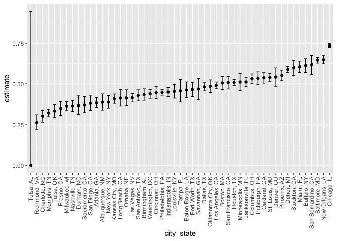

p8105_hw5_kac2301
================
Kate Colvin

# Problem 1

``` r
birthday_duplicates = function(n){
  return(length(unique(sample.int(365, n, replace = TRUE))) != n)
}

n = 50
output <- c()

for(i in 2:n){
  output[i-1] = 0
  for(j in 1:10000){
    output[i-1] = output[i-1] + birthday_duplicates(i)
  }
}

birth_df <- tibble(duplicate_prop = output/10000) %>% 
  mutate(n = 2:50)

birth_df %>% ggplot(aes(x = n, y = duplicate_prop)) +
  geom_point()
```

<!-- -->

# Problem 2

Producing simulation:

``` r
output <- vector("list", 35000)

n = 30
mu = 0:6
sigma = 5 

for(j in mu){
  k <- 1+(j*5000)
  # Looping over 5000 data sets 
  for (i in 1:5000) {
      sim_data = tibble(
        x = rnorm(n, mean = j, sd = sigma),
      )
      output[[k]] <- t.test(sim_data, mu = 0, conf.level = 0.95) %>% 
        broom::tidy() %>% 
        select(estimate, p.value) %>% 
        mutate(set_mu = j)
      k <- k + 1
  }
}

sim_results <- bind_rows(output) %>% 
  mutate(null_rejected = p.value <= 0.05)
sim_results
```

    ## # A tibble: 35,000 × 4
    ##    estimate p.value set_mu null_rejected
    ##       <dbl>   <dbl>  <int> <lgl>        
    ##  1   -1.52   0.0812      0 FALSE        
    ##  2   -0.208  0.817       0 FALSE        
    ##  3   -0.554  0.559       0 FALSE        
    ##  4   -0.678  0.497       0 FALSE        
    ##  5    0.373  0.718       0 FALSE        
    ##  6    0.643  0.474       0 FALSE        
    ##  7   -0.671  0.483       0 FALSE        
    ##  8    0.826  0.354       0 FALSE        
    ##  9    1.02   0.296       0 FALSE        
    ## 10    1.14   0.113       0 FALSE        
    ## # ℹ 34,990 more rows

Creating plot of the power vs. the true mean:

``` r
sim_results %>% 
  ggplot(aes(x = set_mu, fill = null_rejected)) + 
  geom_bar(position = "fill") + 
  xlab("Actual Mean") + ylab("Proportion")
```

<!-- -->

As effect size increases (in this case, the difference between 0 and the
actual mean), so does the power. When the actual mean is 6, which is
very far from 0, we correctly reject the null 100% of the time.

Creating plots comparing the average estimated mean and the true mean:

``` r
sim_results %>% 
  group_by(set_mu) %>% 
  summarize(avg_est = mean(estimate)) %>% 
  ggplot(aes(x = mu, y = avg_est)) +
  geom_point() +
  geom_abline() +
  ggtitle("Average Estimate vs. True Mean")
```

<!-- -->

``` r
sim_results %>% 
  filter(null_rejected == TRUE) %>% 
  group_by(set_mu) %>% 
  summarize(avg_est = mean(estimate)) %>% 
  ggplot(aes(x = set_mu, y = avg_est)) +
  geom_point() + 
  geom_abline() + 
  ggtitle("Average Estimate for Samples Where the Null was Rejected vs. True Mean")
```

<!-- -->

The average of the estimated sample means across tests where the null
was rejected is not approximately equal to the true mean across all the
selected values. When we set the true mean to 0, 4, 5, and 6, the
average estimated mean is consistent with those values. This is because
for means 4, 5, and 6, we rejected the null more than 99% of the time,
so the average of the estimated means where the null was rejected is
basically just the same as the average of the estimated means overall.
When the mean is set to 0, the estimated sample means for the cases
where we rejected the null will still have values close to 0.

When the true mean is set to 1, 2, or 3, we can see on the graph that
the average estimated sample means across tests where the null was
rejected are higher than their respective true means. This is because
cases where we rejected the null are likely to have means further away
from 0, since this would make us more likely to be able to detect that
the true underlying mean is not 0.

# Problem 3

The raw data, shown below, describes the homicides in 50 large American
cities. It has 12 columns and 52,179 entries, and each row represents a
person killed in a homicide. Some of the important variables include the
reported date, victim age and race, the city where they were killed, and
disposition (status of the case).

``` r
homicide_df <- read_csv("homicide-data.csv")
```

    ## Rows: 52179 Columns: 12
    ## ── Column specification ────────────────────────────────────────────────────────
    ## Delimiter: ","
    ## chr (9): uid, victim_last, victim_first, victim_race, victim_age, victim_sex...
    ## dbl (3): reported_date, lat, lon
    ## 
    ## ℹ Use `spec()` to retrieve the full column specification for this data.
    ## ℹ Specify the column types or set `show_col_types = FALSE` to quiet this message.

``` r
head(homicide_df)
```

    ## # A tibble: 6 × 12
    ##   uid   reported_date victim_last victim_first victim_race victim_age victim_sex
    ##   <chr>         <dbl> <chr>       <chr>        <chr>       <chr>      <chr>     
    ## 1 Alb-…      20100504 GARCIA      JUAN         Hispanic    78         Male      
    ## 2 Alb-…      20100216 MONTOYA     CAMERON      Hispanic    17         Male      
    ## 3 Alb-…      20100601 SATTERFIELD VIVIANA      White       15         Female    
    ## 4 Alb-…      20100101 MENDIOLA    CARLOS       Hispanic    32         Male      
    ## 5 Alb-…      20100102 MULA        VIVIAN       White       72         Female    
    ## 6 Alb-…      20100126 BOOK        GERALDINE    White       91         Female    
    ## # ℹ 5 more variables: city <chr>, state <chr>, lat <dbl>, lon <dbl>,
    ## #   disposition <chr>

Creating city_state variable and summarizing the total number of
homicides and unsolved homicides:

``` r
# Obtaining solved/unsolved counts

homicide_status_df <- homicide_df %>% 
  unite(city_state, city, state, sep = ", ") %>% 
  mutate(case_status = 
           case_match(
             disposition, 
             "Closed without arrest" ~ "unsolved",
             "Open/No arrest" ~ "unsolved", 
             "Closed by arrest" ~ "solved"
           )) %>% 
  group_by(city_state, case_status) %>% 
  summarize(count = n())
```

    ## `summarise()` has grouped output by 'city_state'. You can override using the
    ## `.groups` argument.

``` r
# Obtaining totals by city 

homicide_count_df <- homicide_df %>% 
  unite(city_state, city, state, sep = ", ") %>%
  group_by(city_state) %>% 
  summarize(total = n())

# Merging counts by status and totals 

homicide_table <- left_join(homicide_status_df, homicide_count_df, by = "city_state") %>% 
  pivot_wider(names_from = case_status, 
              values_from = count) %>% 
  replace_na(list(unsolved = 0))
homicide_table
```

    ## # A tibble: 51 × 4
    ## # Groups:   city_state [51]
    ##    city_state      total solved unsolved
    ##    <chr>           <int>  <int>    <int>
    ##  1 Albuquerque, NM   378    232      146
    ##  2 Atlanta, GA       973    600      373
    ##  3 Baltimore, MD    2827   1002     1825
    ##  4 Baton Rouge, LA   424    228      196
    ##  5 Birmingham, AL    800    453      347
    ##  6 Boston, MA        614    304      310
    ##  7 Buffalo, NY       521    202      319
    ##  8 Charlotte, NC     687    481      206
    ##  9 Chicago, IL      5535   1462     4073
    ## 10 Cincinnati, OH    694    385      309
    ## # ℹ 41 more rows

For Baltimore, MD, using prop.test to estimate the proportion of
homicides that are unsolved:

``` r
balt_test <- prop.test(1825, 2827) %>% 
  broom::tidy() %>% select(estimate, conf.low, conf.high)

balt_test
```

    ## # A tibble: 1 × 3
    ##   estimate conf.low conf.high
    ##      <dbl>    <dbl>     <dbl>
    ## 1    0.646    0.628     0.663

For each city, using prop.test to estimate the proportion of homicides
that are unsolved:

``` r
city_tests <- homicide_table %>% 
  mutate(
    est_props = map((map2(unsolved, total, \(un, tot) prop.test(un, tot))), broom::tidy)) %>% 
  unnest(cols = c(est_props)) %>% 
  select(city_state, unsolved, total, estimate, conf.low, conf.high)
```

    ## Warning: There was 1 warning in `mutate()`.
    ## ℹ In argument: `est_props = map(...)`.
    ## ℹ In group 49: `city_state = "Tulsa, AL"`.
    ## Caused by warning in `prop.test()`:
    ## ! Chi-squared approximation may be incorrect

``` r
city_tests
```

    ## # A tibble: 51 × 6
    ## # Groups:   city_state [51]
    ##    city_state      unsolved total estimate conf.low conf.high
    ##    <chr>              <int> <int>    <dbl>    <dbl>     <dbl>
    ##  1 Albuquerque, NM      146   378    0.386    0.337     0.438
    ##  2 Atlanta, GA          373   973    0.383    0.353     0.415
    ##  3 Baltimore, MD       1825  2827    0.646    0.628     0.663
    ##  4 Baton Rouge, LA      196   424    0.462    0.414     0.511
    ##  5 Birmingham, AL       347   800    0.434    0.399     0.469
    ##  6 Boston, MA           310   614    0.505    0.465     0.545
    ##  7 Buffalo, NY          319   521    0.612    0.569     0.654
    ##  8 Charlotte, NC        206   687    0.300    0.266     0.336
    ##  9 Chicago, IL         4073  5535    0.736    0.724     0.747
    ## 10 Cincinnati, OH       309   694    0.445    0.408     0.483
    ## # ℹ 41 more rows

Creating a plot that shows the estimates and CIs for each city:

``` r
city_tests %>% ggplot(aes(x = fct_reorder(city_state, estimate), y = estimate)) +
  geom_point() +
  geom_errorbar(aes(ymin = conf.low, ymax = conf.high), width = 0.5) +
  theme(axis.text.x = element_text(angle = 90, vjust = 0.5, hjust=1)) +
  xlab("city_state")
```

<!-- -->
